# GeoCam Sync

## 1. Project Title and Description

- Project title: `GeoCam Sync`
- Description: A feature-first Flutter application with two modules: `Task 1 (Geo-Fenced Attendance)` and `Task 2 (Upload Manager)`. It focuses on permission-aware workflows, offline-first local persistence, and network-aware sync behavior.

For full product journey, navigation map, test scenarios, and edge cases, see:
- [End-to-End User Journey](docs/project/end-to-end-user-journey.md)
- [Screen and Navigation Map](docs/project/screen-navigation-map.md)
- [Flow and Coverage Reference](docs/project/flow-and-coverage-reference.md)
- [Task 1 Testing Guide](docs/task1/task1-testing-guide.md)
- [Task 2 Testing Guide](docs/task2/task2-testing-guide.md)

## 2. Project Structure / Approaches

This project follows a feature-first layered architecture (`presentation`, `domain`, `data`) with Cubit-based state management. Core app orchestration is handled by `AttendanceCubit`, `UploadManagerCubit`, `SyncEngineCubit`, and `CameraPreviewCubit`.

For full architecture details:
- [Project Walkthrough](docs/project/project-walkthrough.md)
- [Task 1 Folder Structure Rationale](docs/task1/folder-structure-rationale.md)
- [Package Usage Map](docs/setup/package-usage-map.md)

## 3. Generative AI Usage

Generative AI was used as an engineering accelerator for module refactoring, architecture cleanup, and documentation drafting, while final decisions and validation stayed human-controlled.

Essential prompt examples used in this project:
- "Review this Flutter feature module and identify unused data/domain/presentation scaffolding that can be safely removed."
- "Refactor shared app bar behavior so language switcher becomes the default action when no custom action is passed."
- "Scan the app for user-facing hardcoded strings that are missing localization and list only the necessary ones."
- "Convert presentation-layer sizing to flutter_screenutil using .h, .w, .r, and .sp where appropriate."
- "Group current repository changes into logical conventional commits with scope-based descriptions."

For full AI journey notes:
- [Generative AI Usage](docs/agent-journey/generative-ai-usage.md)

## 4. How to Run

### Clone and open the project

```bash
git clone --branch main --single-branch <your-repo-url>
cd GeoCam-Sync
```

Use the `main` branch for setup and running this project.

### Install dependencies and generate required files

```bash
flutter pub get
dart run build_runner build --delete-conflicting-outputs
flutter gen-l10n
```

### Run the app

```bash
flutter run
```

## 5. Screenshots

### Home
<p align="center">
  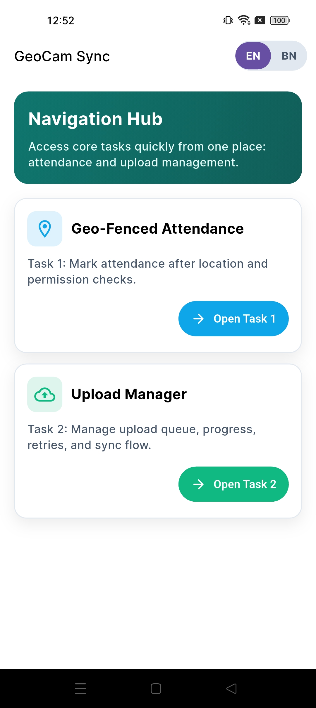
</p>

### Task 1: Attendance
<p align="center">
  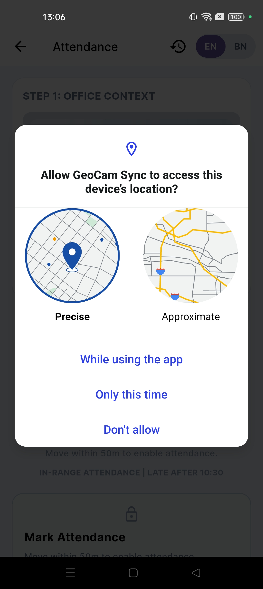
  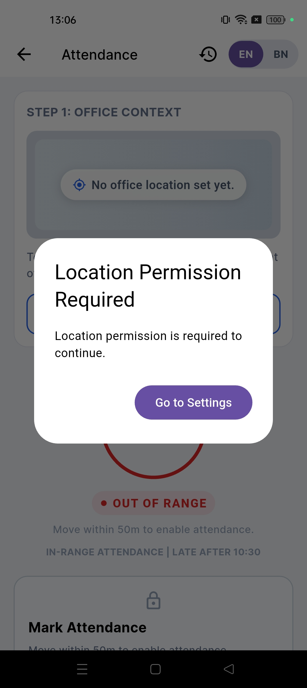
  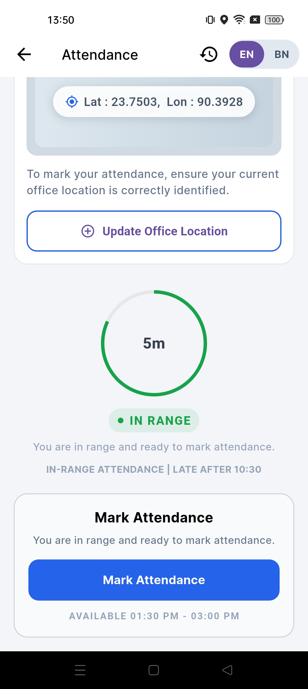
  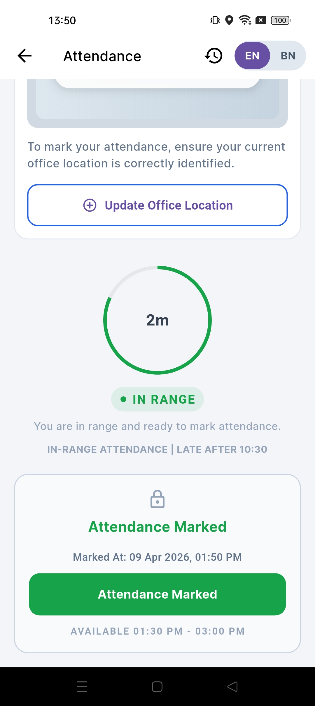
  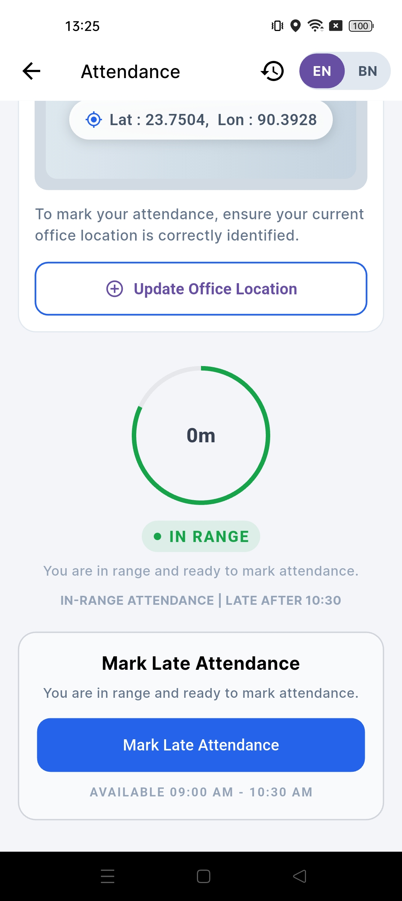
</p>

### Task 2: Upload Manager
<p align="center">
  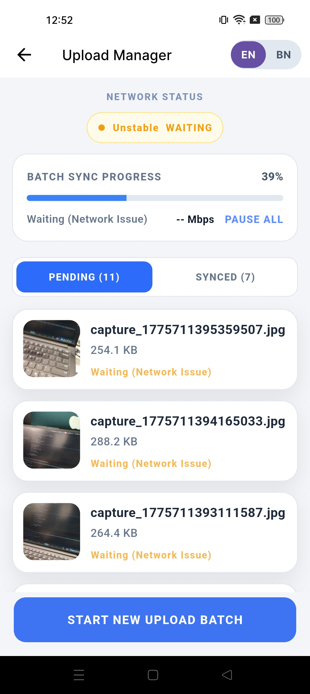
  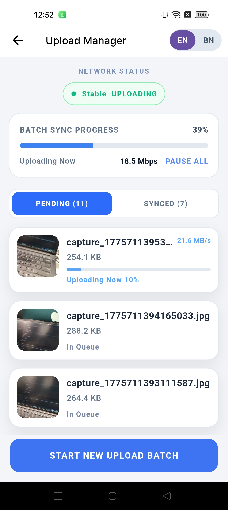
  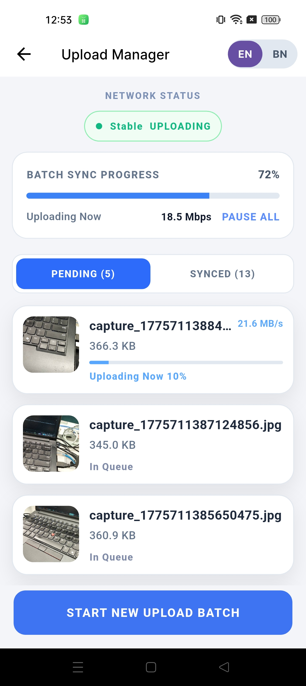
  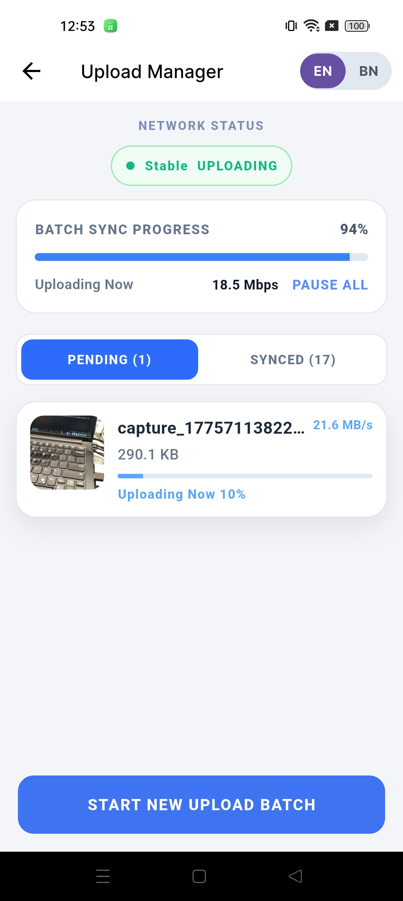
  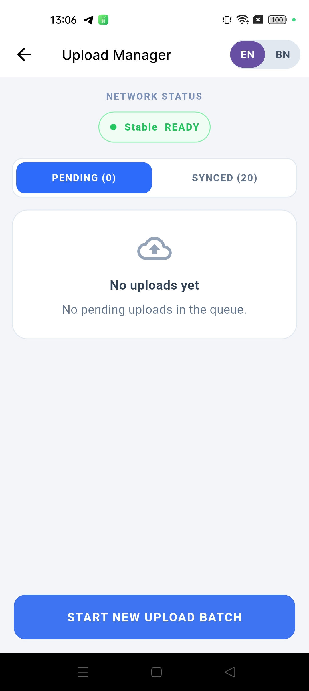
</p>
